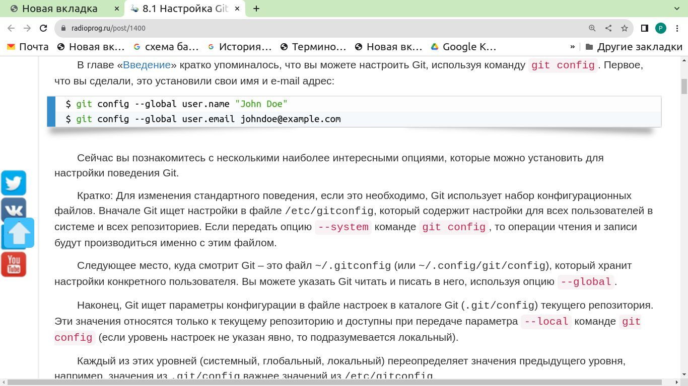
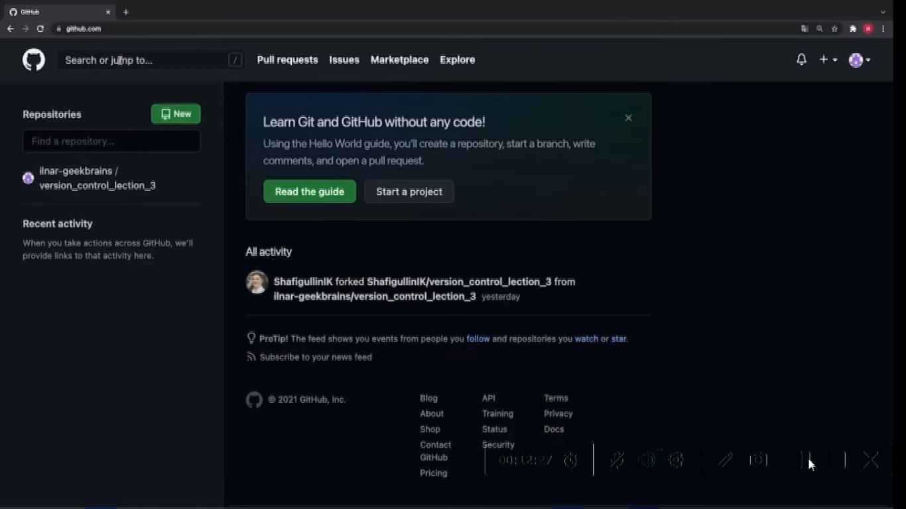
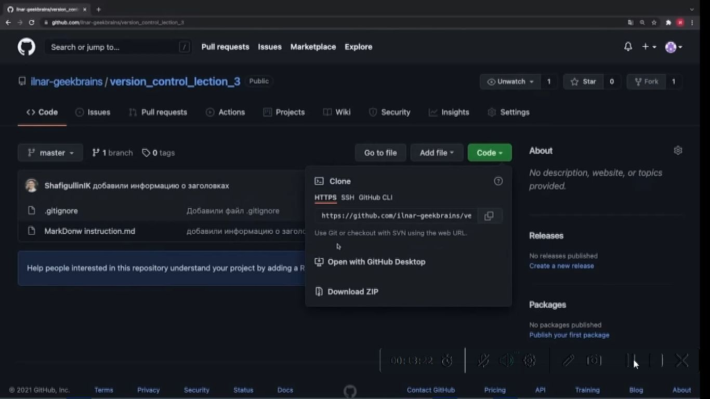
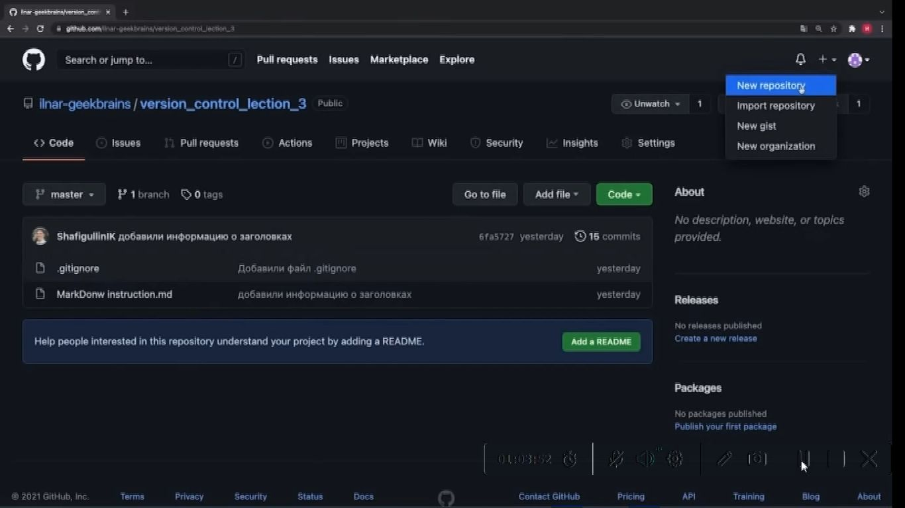
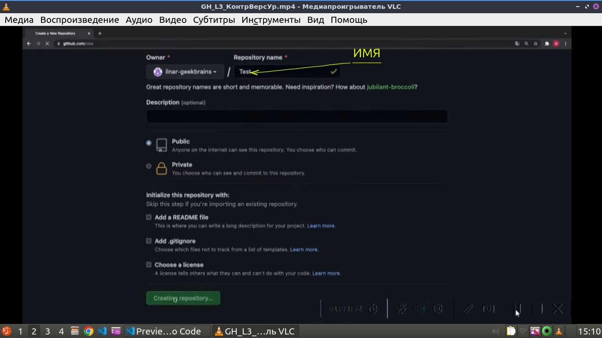
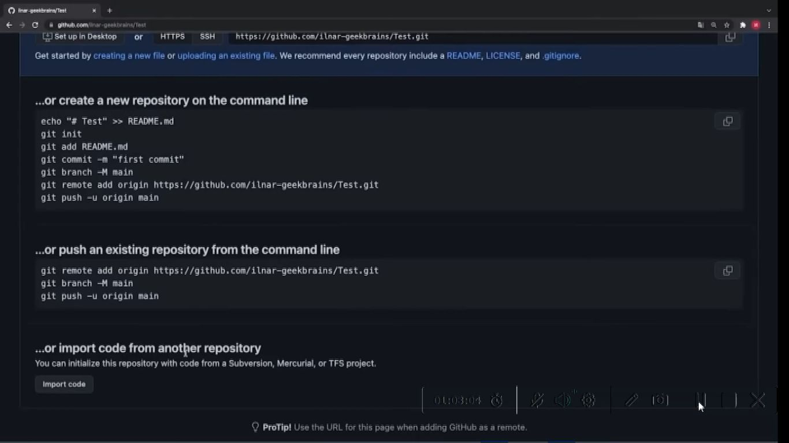

### Part1: __GH_L1_КонтрольВерсий27.mp4__
### Part2: __GH_L2_КонтрВерс.mp4__
### Part3: __GH_L3_КонтрВерсУр.mp4__
### __location information is:  Google disk/MyLocations__ 
&nbsp;&nbsp;
 
### 1) Показать версию git 
<details>
<summary></summary>

```javascript
git --version
```
</details>

### 2) Инициализировать git в текущей папке

<details>
<summary></summary>

```javascript
git init
```
</details>

### 3) Узнать статус файлов с точки зрения git

<details>
<summary></summary>

```javascript
git status
```
</details>

### 4) Добавить файл в индекс отслеживания и сохранения git

<details>
<summary></summary>

```javascript
git add <file nime>
```
</details>

### 5) Клавиша дописывающая имя файла после введения первых символов ( от 2х и более если больше букв необходимо для идентификации)

<details>
<summary></summary>

```javascript
tab
```
</details>

### 6) Зафиксировать текущее состояние файлов индекса git с указанием комментария

<details>
<summary></summary>

```javascript
git commit -m "текст комментария"
```
</details>

### 7) Вызвать журнал git

<details>
<summary></summary>

```javascript
git log
```
</details>

### 8) загрузить commit (загрузить сохраненую версию)

<details>
<summary></summary>

```javascript
ввести команду и первые 4 симовала имени commit
например: git checkout 5c2a
```
</details>

### 9) меняется ли состояние файла при переходе от commit к commit

<details>
<summary></summary>

```javascript
Нет. При переходе от одного commit к другому commit git показывает состояние в котором на момент созданния commit находился файл, при этом не изменяя его.
```
</details>

### 10) Что необходимо после загрузки commit для продолжения работы с git

<details>
<summary></summary>

```javascript
Для продолжения работы с git после загрузки commit необходимо загрузить актуальную версию,  и выполнить команду git checkout master
```
</details>


### 11) Какая существует команда git для сравнения сохраненных файлов и файлов изменения в которые внесены но не сохранены, при сравнении какими цветами и какие изменения демонстрируются

<details>
<summary></summary>

```javascript
git diff

-  красным цветом демонстрируются удаленные файлы
-  зеленым созданные
```
</details>


### 12) Как принято называть первый commit в реопозитории
<details>
<summary></summary>

```javascript
Initial commit (инишин коммит)
```
</details>


### 13) что необходимо сделать при первых настойках git

<details>
<summary></summary>

```javascript
Представиться git: git config <name>, затем: git config <email>
```
### например:



</details>


### 14) команда git выводит список имеющихся веток, указывает текущую ветку

<details>
<summary></summary>

```javascript
git branch
```
</details>


### 15) очистить терминал

<details>
<summary></summary>

```javascript
clear
```
</details>


### 16) команда создания ветки

<details>
<summary></summary>

```javascript
git branch <name>
```
</details>


### 17) как отмечается текущая ветка

<details>
<summary></summary>

```javascript
*
```
</details>


### 18) команда git на слияние определенной ветки с текущей веткой

<details>
<summary></summary>

```javascript
git merge <name branch>
```
</details>


### 19) команда git удалить ветку

<details>
<summary></summary>

```javascript
git branch -d <name branch>
Формат удаления: git(указывает что команда для git), branch(указывает что команда направлена 
на некоторую ветку), -d(флаг указывает на необходимость удаления), имя ветки указывает какую 
именно ветку необходимо удалить
```
</details>

### 20) имя файла в котором указываются игнорируемые файлы git

<details>
<summary></summary>

```javascript
.gitignor

```
</details>

### 21) Какие варианты разрешения конфликта возникшего при слияние веток с разными версиями 
одного и того же фрагмента предалагает выбрать git

<details>
<summary></summary>

```javascript
1. Accept Current Change (Принять вариант из текущей ветки т.е. в которую вливают ветку)
2. Accept Incoming Change (Принять вариант из вливаемой ветки)
3. Accept Both Change (Сохранить оба варианта)
4. Accept Changes (Сравнить)
```
</details>

### 22) команда git графического отображения журнала

<details>
<summary></summary>

```javascript
git log --graph
```
</details>

### 23) интернет-адрес тренажера git

<details>
<summary></summary>

```javascript
https://learngitbranching.js.org/
```
</details>

### 24) Окно поиска Git-Hab

<details>
<summary></summary>




</details>


### 25) Вариант получения копии адреса реопозитория

<details>
<summary></summary>


</details>

### 26) Команда создания локальной копии реопозитория с реопозитория GitHab 

<details>
<summary></summary>

```javascript
git clone <интернет адрес реопозитория на GitHab>
```
</details>

### 27) Порядок создания реопозитория

<details>
<summary></summary>

1. Создать на GitHab аккаунт
2. Создать реопозиторий например нажав указателем мыши на "+" 
   и выбрать пункт меню "Новый репозиторий"



3. Присвоить репозиторию имя, можно сделать соотвествующие настройки,
либо оставить из по умолчанию.




</details>


### 28) Какие дальнейшие варианты после создания реопозитория предлагает GitHab

<details>
<summary></summary>


1. создать новый репозиторий через терминал и начать с ним работать
2. существующий репозиторий привязать к этому репозиторию
3. имопортировать код из другого репозитория


</details>


### ..) .......................................

<details>
<summary></summary>

```javascript
..........................
```
</details>
### ..) .......................................

<details>
<summary></summary>

```javascript
..........................
```
</details>
### ..) .......................................

<details>
<summary></summary>

```javascript
..........................
```
</details>
### ..) .......................................

<details>
<summary></summary>

```javascript
..........................
```
</details>
### ..) .......................................

<details>
<summary></summary>

```javascript
..........................
```
</details>
### ..) .......................................

<details>
<summary></summary>

```javascript
..........................
```
</details>
### ..) .......................................

<details>
<summary></summary>

```javascript
..........................
```
</details>
### ..) .......................................

<details>
<summary></summary>

```javascript
..........................
```
</details>
### ..) .......................................

<details>
<summary></summary>

```javascript
..........................
```
</details>
### ..) .......................................

<details>
<summary></summary>

```javascript
..........................
```
</details>

### ..) .......................................

<details>
<summary></summary>

```javascript
..........................
```
</details>

