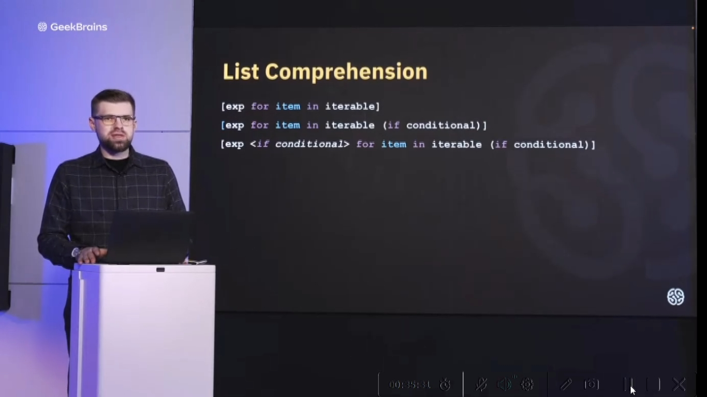
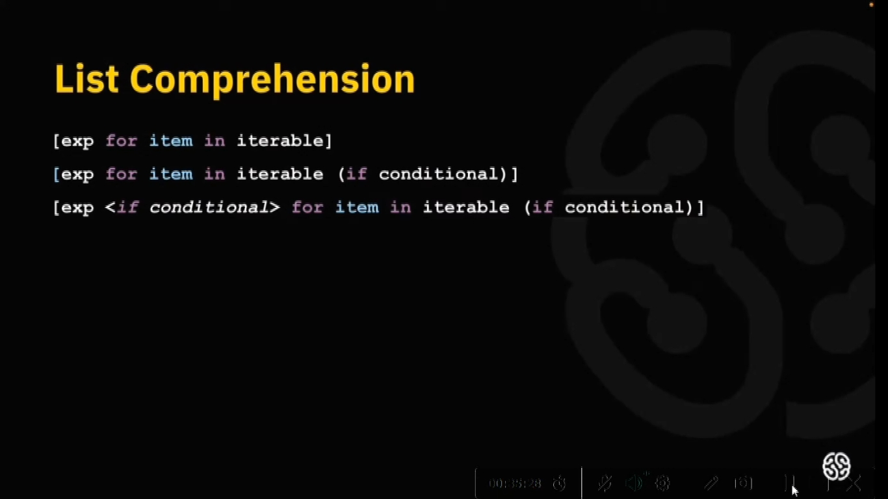

1)..

<details>
<summary></summary>

```lavascript

...

```
</details>


2) Образец lambda (аналог функции)

<details>
<summary></summary>

```lavascript

функция:

def sum(x, y):
    return x + y


сокращенный аналог (lambda):

f = lambda q, w: q + w

или так:

calx(lambda q, w: q + w, 4, 5) 

где calx (имя функции)

после lambda q, w (два аргумента принимающие значения)
             q + w (действие с этими аргументами которое производится)
             4, 5 ( значения принимаемых аргументов)


```
</details>


3) Что можно использовать для быстрого создания списков

<details>
<summary></summary>




```lavascript

Пример создания списка:

List = []
for i in range(0, 101):
list.apptnd(i)

Аналог созданный с помощью List comprehension:

List = [i for in range(0, 101)]

Или:

List = []
for i in range(0, 101):
if (i%2 == 0):
list.apptnd(i)

Аналог:
List = [i for i in range(0, 101) if i%2 == 0]

Или (с получением списка кортежей):

List = [ (i, i) for i in range(0, 101) if i%2 == 0]

Пример вставки функции в List comprehension:

def f(x):
return x**3

List = [f(i) for i in range(0, 101) if i%2 == 0]

(Отобранные с помощью кода (if i%2 == 0) четные значения будут возведены с помощью функции (f) в 3-ю степень )

Пример подключения в List comprehension кортежей:

List = [(i, f(i)) for i in range(0, 101) if i%2 == 0]
 


```
</details>


..)..

<details>
<summary></summary>

```lavascript

...

```
</details>


..)..

<details>
<summary></summary>

```lavascript

...

```
</details>


..)..

<details>
<summary></summary>

```lavascript

...

```
</details>


..)..

<details>
<summary></summary>

```lavascript

...

```
</details>


..)..

<details>
<summary></summary>

```lavascript

...

```
</details>


..)..

<details>
<summary></summary>

```lavascript

...

```
</details>


..)..

<details>
<summary></summary>

```lavascript

...

```
</details>


..)..

<details>
<summary></summary>

```lavascript

...

```
</details>


..)..

<details>
<summary></summary>

```lavascript

...

```
</details>


..)..

<details>
<summary></summary>

```lavascript

...

```
</details>


..)..

<details>
<summary></summary>

```lavascript

...

```
</details>


..)..

<details>
<summary></summary>

```lavascript

...

```
</details>


..)..

<details>
<summary></summary>

```lavascript

...

```
</details>


..)..

<details>
<summary></summary>

```lavascript

...

```
</details>


..)..

<details>
<summary></summary>

```lavascript

...

```
</details>


..)..

<details>
<summary></summary>

```lavascript

...

```
</details>


..)..

<details>
<summary></summary>

```lavascript

...

```
</details>


..)..

<details>
<summary></summary>

```lavascript

...

```
</details>


..)..

<details>
<summary></summary>

```lavascript

...

```
</details>


..)..

<details>
<summary></summary>

```lavascript

...

```
</details>


..)..

<details>
<summary></summary>

```lavascript

...

```
</details>


..)..

<details>
<summary></summary>

```lavascript

...

```
</details>


..)..

<details>
<summary></summary>

```lavascript

...

```
</details>


..)..

<details>
<summary></summary>

```lavascript

...

```
</details>


..)..

<details>
<summary></summary>

```lavascript

...

```
</details>


..)..

<details>
<summary></summary>

```lavascript

...

```
</details>


..)..

<details>
<summary></summary>

```lavascript

...

```
</details>


..)..

<details>
<summary></summary>

```lavascript

...

```
</details>


..)..

<details>
<summary></summary>

```lavascript

...

```
</details>


..)..

<details>
<summary></summary>

```lavascript

...

```
</details>


..)..

<details>
<summary></summary>

```lavascript

...

```
</details>


..)..

<details>
<summary></summary>

```lavascript

...

```
</details>


..)..

<details>
<summary></summary>

```lavascript

...

```
</details>


..)..

<details>
<summary></summary>

```lavascript

...

```
</details>


..)..

<details>
<summary></summary>

```lavascript

...

```
</details>


..)..

<details>
<summary></summary>

```lavascript

...

```
</details>


..)..

<details>
<summary></summary>

```lavascript

...

```
</details>


..)..

<details>
<summary></summary>

```lavascript

...

```
</details>


..)..

<details>
<summary></summary>

```lavascript

...

```
</details>


..)..

<details>
<summary></summary>

```lavascript

...

```
</details>


..)..

<details>
<summary></summary>

```lavascript

...

```
</details>


..)..

<details>
<summary></summary>

```lavascript

...

```
</details>


..)..

<details>
<summary></summary>

```lavascript

...

```
</details>


..)..

<details>
<summary></summary>

```lavascript

...

```
</details>


..)..

<details>
<summary></summary>

```lavascript

...

```
</details>


..)..

<details>
<summary></summary>

```lavascript

...

```
</details>


..)..

<details>
<summary></summary>

```lavascript

...

```
</details>


..)..

<details>
<summary></summary>

```lavascript

...

```
</details>


..)..

<details>
<summary></summary>

```lavascript

...

```
</details>


..)..

<details>
<summary></summary>

```lavascript

...

```
</details>


..)..

<details>
<summary></summary>

```lavascript

...

```
</details>


..)..

<details>
<summary></summary>

```lavascript

...

```
</details>


..)..

<details>
<summary></summary>

```lavascript

...

```
</details>


..)..

<details>
<summary></summary>

```lavascript

...

```
</details>


..)..

<details>
<summary></summary>

```lavascript

...

```
</details>


..)..

<details>
<summary></summary>

```lavascript

...

```
</details>


..)..

<details>
<summary></summary>

```lavascript

...

```
</details>


..)..

<details>
<summary></summary>

```lavascript

...

```
</details>


..)..

<details>
<summary></summary>

```lavascript

...

```
</details>


..)..

<details>
<summary></summary>

```lavascript

...

```
</details>


..)..

<details>
<summary></summary>

```lavascript

...

```
</details>


..)..

<details>
<summary></summary>

```lavascript

...

```
</details>


..)..

<details>
<summary></summary>

```lavascript

...

```
</details>


..)..

<details>
<summary></summary>

```lavascript

...

```
</details>


..)..

<details>
<summary></summary>

```lavascript

...

```
</details>


..)..

<details>
<summary></summary>

```lavascript

...

```
</details>


..)..

<details>
<summary></summary>

```lavascript

...

```
</details>


..)..

<details>
<summary></summary>

```lavascript

...

```
</details>


..)..

<details>
<summary></summary>

```lavascript

...

```
</details>


..)..

<details>
<summary></summary>

```lavascript

...

```
</details>


..)..

<details>
<summary></summary>

```lavascript

...

```
</details>


..)..

<details>
<summary></summary>

```lavascript

...

```
</details>


..)..

<details>
<summary></summary>

```lavascript

...

```
</details>


..)..

<details>
<summary></summary>

```lavascript

...

```
</details>


..)..

<details>
<summary></summary>

```lavascript

...

```
</details>


..)..

<details>
<summary></summary>

```lavascript

...

```
</details>


..)..

<details>
<summary></summary>

```lavascript

...

```
</details>


..)..

<details>
<summary></summary>

```lavascript

...

```
</details>


..)..

<details>
<summary></summary>

```lavascript

...

```
</details>


..)..

<details>
<summary></summary>

```lavascript

...

```
</details>


..)..

<details>
<summary></summary>

```lavascript

...

```
</details>


..)..

<details>
<summary></summary>

```lavascript

...

```
</details>


..)..

<details>
<summary></summary>

```lavascript

...

```
</details>


..)..

<details>
<summary></summary>

```lavascript

...

```
</details>


..)..

<details>
<summary></summary>

```lavascript

...

```
</details>

