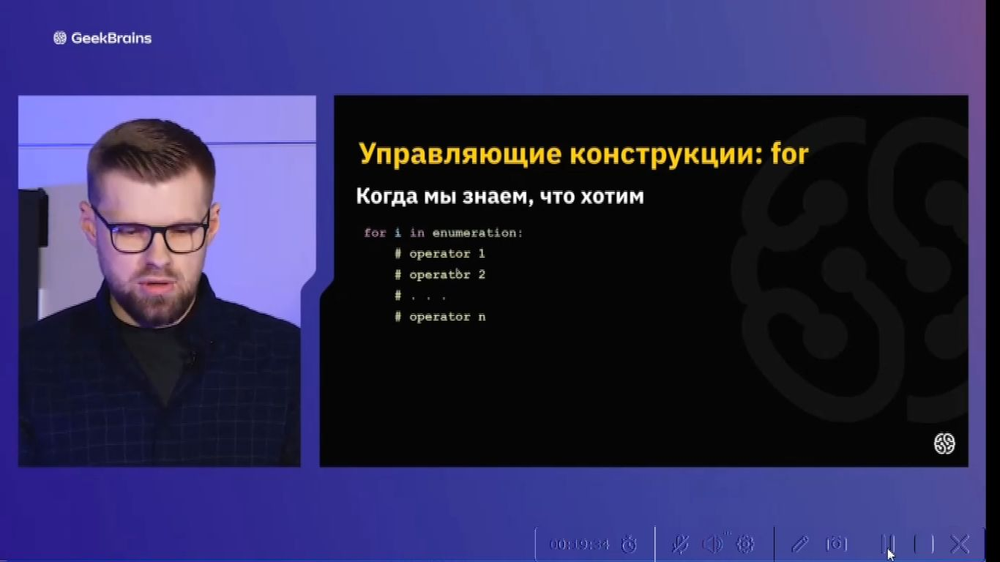

00.00.00 - 00.10.44 Введение и настройка окружения

1) Плюсы Python

<details>
<summary></summary>

```lavascript

- простой синтаксис
- популярность (легче найти работу с Python)
- много библиотек
- крос платформенность
- 

```
</details>

2) Минусы Python

<details>
<summary></summary>

```lavascript
......

```
</details>

3) Для чего используется Python

<details>
<summary></summary>

```lavascript
- Для аналитики
- Для машинного обучения
- Для обработки больших данных
- В том числе пишут классический софт
- 

```
</details>


5) С помощью чего исполняется Python

<details>
<summary></summary>

```lavascript
С попощью интерпритатора  Python                        

```
</details>


6)Запуск скрипта Python с открытием консоли Python

<details>
<summary></summary>

```lavascript

python -i lec.py

```
</details>

7) Сделать файл скрипта lec.py исполняемым

<details>
<summary></summary>


```lavascript
Сохраните изменения, а затем сделайте файл скрипта исполняемым с помощью такой команды:

chmod ugo+x script.py


```
</details>

8) Какие типы данных используются в Python

<details>
<summary></summary>

```lavascript
1. int - целые числа 
2. float - числа с плавающей точкой
3. boolean - логический тип
4. str, list - строки
и др.


```
</details>

9)Что необходимо для объявления переменной

<details>
<summary></summary>

```lavascript
достаточно указать индефикатор и оператор присваивания с передачей каких-либо данных 

например:

value = None #пустое значение
a = 123 #int
b = 1.23 #float
s = 'hello world' #string
t = True #логический тип
f = False #логический тип

```
</details>

10) Проверить тип данных

<details>
<summary></summary>

```lavascript
type (a)
type (d)


```
</details>

11) Переход на новую строку

<details>
<summary></summary>

```lavascript

\n # бэкслыш н

```
</details>

12) Примеры интерполяции

<details>
<summary></summary>

```lavascript

print(a,b,s) #интерполяция
print (a,'-',b,'-',s) #интерполяция c заполнителем
print (f'{a}-{b}-{s}') #интерполяция c форматированием
print ('{}-{}-{}'.format(a,b,s)) #интерполяция c форматированием
print ('{1}-{2}-{0}'.format(a,b,s)) #интерполяция c форматированием и перестановкой значений в выводе интерполяции


```
</details>

13) Списки

<details>
<summary></summary>

```lavascript

list = []

list = [1, 2, 3]


```
</details>

14) Ввод и вывод данных

<details>
<summary></summary>

```lavascript

print('Введите а') #вывод
а = input()#ввод
print (a) #вывод

```
</details>

15) как по умолчанию воспринимаются Python символы 1,2,3, и т.д. и что необходимо для восприятия как чисел

<details>
<summary></summary>

```lavascript

как текстовые значения,
для восприятия как числовые значения необходимо использовать int(), float()

```
</details>


16)Операторы арифметических операций в Python

<details>
<summary></summary>


```lavascript
заметка по Python:
a // b #деление в целых числах
a % b  #операция на остаток от деления
a ** b #возведение а в степень b

особенность Python, нет ограничений по колличеству символов

```
</details>


17) Сокращение десятичных дробей

<details>
<summary></summary>


```lavascript

Сокращение обеспечивает функция round. Цифра после запятой в овальных скобках обозначает, до скольки знаков после запятой производить сокращение. Ее отсутствие (например:round(a + d)) указывает на сокращение до целого числа.

```
</details>


18) Сокращенные операции присваивания

<details>
<summary></summary>


```lavascript

Может быть записано сокращенно, так:

```


Это работает и с другими знаками
</details>


19) Логические операции

<details>
<summary></summary>


```lavascript

т.е. отрицание, коньюнкция и дезъюнкция выгледят несколько иначе, плюс добавляется еще функционал Python

```
</details>


20) Пример проверки на четность(нечетность)

<details>
<summary></summary>


```lavascript

Пример: строка 130

```
</details>


21) Общий вид операции управления If, If-Else

<details>
<summary></summary>


```lavascript

Отступы обязательны

```
Пример:


</details>


22) Другой вариант использования оператора упралвения

<details>
<summary></summary>


```lavascript

Пример:

```


</details>


23) Синтаксис оператора While

<details>
<summary></summary>


```lavascript
Отступы важны !!!

Пример: (переворачивает числа)

```


</details>


24) Синтаксис оператора While Else

<details>
<summary></summary>


```lavascript

После выполнения условия выполняется Else

Пример:

```


</details>


25) Синтаксис оператора For

<details>
<summary></summary>



```lavascript

Пример 1,2:
(Последовательно выводит квадраты чисел списка)
Примеры с использованием объекта  range: 3, 3.1, 
3.2 в пределах(диапозон) от 1 до 4,
3.3 счетчик перебора увеличили до 2-х элементов 
третьим (крайним с права) значением в овальных скобках 
т.е в конкретном случае выводит только нечетные числа из 
списка элементов расположенных по порядку
Пример 4 (с использоваие текстовых значений)

```


</details>


26) Заметки по базовому синтаксису строк

<details>
<summary></summary>


```lavascript

Комментарий эскиза :
1 строка - присваиваение
2 строка - получение колличества символов строки
3 строка - проверяем наличие подстроки в строке
4 строка - проверка являются ли все симоволы строки числами
5 строка - являются ли все символы строки симоваломи нижнего регистра
6 строка - замена одного фргамента другим
```


```lavascript

Комментарий эскиза :
Точка позволяет получить подсказки

```


```lavascript

Комментарий эскиза :
Код в строке 257 помогает получить подсказку справки Python по элементу

```

</details>


27) Срезы (Заметки по базовому синтаксису строк)

<details>
<summary></summary>


```lavascript

Комментарий эксиза:
Представляем сроку как массив символов и таким образом обращаемся к символам по их индексам
Замечание: строка 272 выдает ошибку, т.к. индексация с нуля, что иногда требует в работе приминения минусовых индексов для избежания ошибок

Замечание: при исполользовании минусовых индексов, символы строки на которые они указывают  считаются от конца строки к началу

Замечание: исползование ":" в строке 275 позволяет выводить диапазон от первого симовало до последнего т.к. синтаксис Python  читает это по умолчанию как (text [0:len(техт)-1])

Замечание: 276 строка выводит от 2 до 5 симовола


```
</details>


28) Задание списка


<details>
<summary></summary>


```lavascript

Комментарий к эскизам:

Строка 301: задание списка путем внесения элементов
Строки 303,305: задание списка путем использования range
Строка 309: к элементам списка можно обращаться, через индекс которые начинаются с 0 
Строка 310: получить длину с помощью функции len
Строка 329: добавить элемент в конец списка
Строки 331,333: удалить конкретный элемент


```
</details>


29) Синтаксис функций


<details>
<summary></summary>


```lavascript
1. def
2. индификатор
3. в круглых скобках аргументы
4. двоеточие
5. тело функции
6. опционально может быть оператор return

Пример функции:

```


</details>

30) Как называеся программа интегрированной среды разработки 

<details>
<summary></summary>

```lavascript

PyCharm (Пайчарм)

```
</details>


..)..

<details>
<summary></summary>

```lavascript

...

```
</details>


..)..

<details>
<summary></summary>

```lavascript

...

```
</details>


..)..

<details>
<summary></summary>

```lavascript

...

```
</details>


..)..

<details>
<summary></summary>

```lavascript

...

```
</details>


..)..

<details>
<summary></summary>

```lavascript

...

```
</details>


..)..

<details>
<summary></summary>

```lavascript

...

```
</details>


..)..

<details>
<summary></summary>

```lavascript

...

```
</details>


..)..

<details>
<summary></summary>

```lavascript

...

```
</details>


..)..

<details>
<summary></summary>

```lavascript

...

```
</details>


..)..

<details>
<summary></summary>

```lavascript

...

```
</details>

