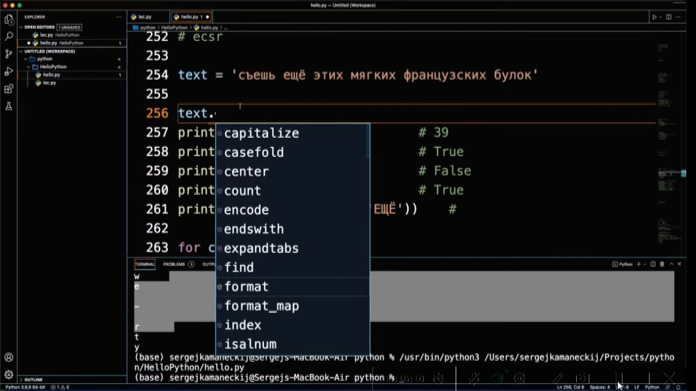

00.00.00 - 00.10.44 Введение и настройка окружения

1) Плюсы Python

<details>
<summary></summary>

```lavascript

- простой синтаксис
- популярность (легче найти работу с Python)
- много библиотек
- крос платформенность
- 

```
</details>

2) Минусы Python

<details>
<summary></summary>

```lavascript
......

```
</details>

3.  Для чего используется Python

<details>
<summary></summary>

```lavascript
- Для аналитики
- Для машинного обучения
- Для обработки больших данных
- В том числе пишут классический софт
- 

```
</details>


5. С помощью чего исполняется Python

<details>
<summary></summary>

```lavascript
С попощью интерпритатора  Python                        

```
</details>


6. Запуск скрипта Python с открытием консоли Python

<details>
<summary></summary>

```lavascript

python -i lec.py

```
</details>

7 Сделать файл скрипта lec.py исполняемым

<details>
<summary></summary>


```lavascript
Сохраните изменения, а затем сделайте файл скрипта исполняемым с помощью такой команды:

chmod ugo+x script.py


```
</details>

8 Какие типы данных используются в Python

<details>
<summary></summary>

```lavascript
1. int - целые числа 
2. float - числа с плавающей точкой
3. boolean - логический тип
4. str, list - строки
и др.


```
</details>

9. Что необходимо для объявления переменной

<details>
<summary></summary>

```lavascript
достаточно указать индефикатор и оператор присваивания с передачей каких-либо данных 

например:

value = None #пустое значение
a = 123 #int
b = 1.23 #float
s = 'hello world' #string
t = True #логический тип
f = False #логический тип

```
</details>

10. Проверить тип данных

<details>
<summary></summary>

```lavascript
type (a)
type (d)


```
</details>

11. Переход на новую строку

<details>
<summary></summary>

```lavascript

\n # бэкслэш н

```
</details>

12) Примеры интерполяции

<details>
<summary></summary>

```lavascript

print(a,b,s) #интерполяция
print (a,'-',b,'-',s) #интерполяция c заполнителем
print (f'{a}-{b}-{s}') #интерполяция c форматированием
print ('{}-{}-{}'.format(a,b,s)) #интерполяция c форматированием
print ('{1}-{2}-{0}'.format(a,b,s)) #интерполяция c форматированием и перестановкой значений в выводе интерполяции

Пример интерполяции в коде с встроенным в строку интерполяции кодом возвращающем логическое (булевое) значение "true" или "false":

xy = input('Введите через запятую числа, которые будут являться значениями: Х,У. Х,У = ').split(",")
print(f'Утвеждение, о том, что введенные числа между собой образуют квадрат, логически соотвествуют: ' +  str(int(xy[0])*int(xy[0]) == int(xy[1]) or int(xy[1])*int(xy[1]) == int(xy[0])))


```
</details>

13) Списки

<details>
<summary></summary>

```lavascript

list = []

list = [1, 2, 3]


```
</details>

14. Ввод и вывод данных

<details>
<summary></summary>

```lavascript

Пример ввода вывода:

print('Введите а') #вывод

а = input()        #ввод

print (a, end =' ') #вывод c добавление разделителя (в данном случае пробела)


Пример ввода в коде программы через заполнитель (в данном случа запятую) нескольких симоволов (в данном случае цифр):

xy = input('Введите значение Х и затем через запятую У: ').split(",")
print(xy)


```
</details>

15) как по умолчанию воспринимаются Python символы 1,2,3, и т.д. и что необходимо для восприятия как чисел

<details>
<summary></summary>

```lavascript

как текстовые значения,
для восприятия как числовые значения необходимо использовать int(), float()

```
</details>


16)Операторы арифметических операций в Python

<details>
<summary></summary>


```lavascript
заметка по Python:
a // b #деление в целых числах
a % b  #операция на остаток от деления
a ** b #возведение а в степень b

особенность Python, нет ограничений по колличеству символов

17) извлечение квадрата:

```lavascript

Мы можем использовать оператор «**» в Python, чтобы получить квадратный корень. Любое число, возведенное в степень 0.5, дает нам квадратный корень из этого числа.

Пример:

num = 25
sqrt = num ** (0.5)
print("Квадратный корень из числа "+str(num)+" это "+str(sqrt))

Квадратный корень из числа можно получить с помощью функции sqrt() из модуля math, как показано ниже.

Пример:

a. Использование положительного числа в качестве аргумента.

import math
num = 25
sqrt = math.sqrt(num)
print("Квадратный корень из числа " + str(num) + " это " + str(sqrt))

b. Использование ноля в качестве аргумента.

import math
num = 0
sqrt = math.sqrt(num)
print("Квадратный корень из числа " + str(num) + " это " + str(sqrt))

c. Использование отрицательного числа в качестве аргумента.

import math
num = -25
sqrt = math.sqrt(num)
print("Квадратный корень из числа " + str(num) + " это " + str(sqrt))

Использование cmath.sqrt()

а. Использование отрицательного числа в качестве аргумента.

import cmath
num = -25
sqrt = cmath.sqrt(num)
print("Квадратный корень из числа " + str(num) + " это " + str(sqrt))

b. Использование комплексного числа в качестве аргумента.

import cmath
num = 4 + 9j
sqrt = cmath.sqrt(num)
print("Квадратный корень из числа " + str(num) + " это " + str(sqrt))

Использование np.sqrt()

import numpy as np
num = -25
sqrt = np.sqrt(num)
print("Квадратный корень из числа " + str(num) + " это " + str(sqrt))

Использование scipy.sqrt()

import scipy as sc
num = 25
sqrt = sc.sqrt(num)
print("Квадратный корень из числа " + str(num) + " это " + str(sqrt))

Использование sympy.sqrt()

import sympy as smp
num = 25
sqrt = smp.sqrt(num)
print("Квадратный корень из числа "+str(num)+" это "+str(sqrt))


```
</details>


17) Сокращение десятичных дробей

<details>
<summary></summary>


```lavascript

Сокращение обеспечивает функция round. Цифра после запятой в овальных скобках обозначает, до скольки знаков после запятой производить сокращение. Ее отсутствие (например:

round(a + d)) #указывает на сокращение до целого числа.

print(round(a * b,2)) #указывает сокращение до 2 десятых

```
</details>


18) Сокращенные операции присваивания

<details>
<summary></summary>


```lavascript

Может быть записано сокращенно, так:

```


Это работает и с другими знаками
</details>


19) Логические операции

<details>
<summary></summary>


```lavascript

т.е. отрицание, коньюнкция и дезъюнкция выгледят несколько иначе, плюс добавляется еще функционал Python

```
</details>


20) Пример проверки на четность(нечетность)

<details>
<summary></summary>


```lavascript

Пример: строка 130

f = [1, 2, 3, 4, 5, 6, 7]
is_nod = not f[3]%2
print(is_nod)

```
</details>


21) Общий вид операции управления If, If-Else

<details>
<summary></summary>


```lavascript

Отступы обязательны

```
Пример:


</details>


22) Другой вариант использования оператора упралвения

<details>
<summary></summary>


```lavascript

Пример:

day_off = int(input('Введите число дня недели : '))

if day_off == 7:
     print('Ура, сегодня воскресенье - выходно ! Можно отдыхать, но не слишком. Завтра на работу.')
elif day_off == 6:
     print('Ура, сегодня суббота - выходной ! Одныхаем по полной !')
elif day_off == 5:
     print('Пятница. Это почти финиш. Еще немного и можно будет наконец раслабиться')
elif day_off == 4:
     print('Четверг. Ну вот и заканчивается рабочая неделя. Продержаться осталось не долго.')
elif day_off == 3:
     print('Среда. Достигли экватора. Да! Мы смогли это сделать!!!')
elif day_off == 2:
     print('Вторник. Еще работать и работать((( ')
elif day_off ==1:
     print('Понедельник. Неделя только началась. Об отдыхе думать еще рано ((( Ни кто так не нуждается в отдыхе, как человек после отдыха((( Мудрость веков...')
else:
     print('Нет такого дня недели. Если будем его указывать. Выходной нам, как не грустно не прибавится')

Пример:
```


</details>


23) Синтаксис оператора While

<details>
<summary></summary>


```lavascript
Отступы важны !!!

Пример: (переворачивает числа)

original = 23
inverted = 0

while original !=0:
    inverted = inverted * 10 + (original%10)
    original = original // 10

```


</details>


24) Синтаксис оператора While Else

<details>
<summary></summary>


```lavascript

После выполнения условия выполняется Else

Пример:

```


</details>


25) Синтаксис оператора For

<details>
<summary></summary>


```lavascript

Пример 1,2:
(Последовательно выводит квадраты чисел списка)
Примеры с использованием объекта  range: 3, 3.1, 
3.2 в пределах(диапозон) от 1 до 4,
3.3 счетчик перебора увеличили до 2-х элементов 
третьим (крайним с права) значением в овальных скобках 
т.е в конкретном случае выводит только нечетные числа из 
списка элементов расположенных по порядку
Пример 4 (с использоваие текстовых значений)

```


</details>


26) Заметки по базовому синтаксису строк

<details>
<summary></summary>


```lavascript

Комментарий эскиза :
1 строка - присваиваение
2 строка - получение колличества символов строки
3 строка - проверяем наличие подстроки в строке
4 строка - проверка являются ли все симоволы строки числами
5 строка - являются ли все символы строки симоваломи нижнего регистра
6 строка - замена одного фргамента другим
```


```lavascript

Комментарий эскиза :
Точка позволяет получить подсказки

```


```lavascript

Комментарий эскиза :
Код в строке 257 помогает получить подсказку справки Python по элементу

```

</details>


27) Срезы (Заметки по базовому синтаксису строк)

<details>
<summary></summary>


```lavascript

Комментарий эксиза:
Представляем сроку как массив символов и таким образом обращаемся к символам по их индексам
Замечание: строка 272 выдает ошибку, т.к. индексация с нуля, что иногда требует в работе приминения минусовых индексов для избежания ошибок

Замечание: при исполользовании минусовых индексов, символы строки на которые они указывают  считаются от конца строки к началу

Замечание: исползование ":" в строке 275 позволяет выводить диапазон от первого симовало до последнего т.к. синтаксис Python  читает это по умолчанию как (text [0:len(техт)-1])

Замечание: 276 строка выводит от 2 до 5 симовола


```
</details>


28) Задание списка


<details>
<summary></summary>


```lavascript

Комментарий к эскизам:

Строка 301: задание списка путем внесения элементов
Строки 303,305: задание списка путем использования range
Строка 309: к элементам списка можно обращаться, через индекс которые начинаются с 0 
Строка 310: получить длину с помощью функции len
Строка 329: добавить элемент в конец списка
Строки 331,333: удалить конкретный элемент


```
</details>

28.1) Копирование списка и особенности копирования (из видеофайла: Pyth1_Em3_L2)

<details>
<summary></summary>


```lavascript
copy(). Копирует объект и возвращает поверхностную копию передаваемого аргумента.

При копировании списка, список1 и список2 становятся взаимозависимыми при дальнейшей работе кода. При изменении списка 1 аналогичным образом меняются данные в списке 2, и так же наоборот т.к. этот метод создает аналогичный объект и присваивает ему ссылку на оригинал, т.е они ссылаются на одит и тот же адрес в О.П.

Новый независимый объект создается копиварованием с помощью метода:
deepcopy(). Тоже копирует объект, но возвращает полную копию передаваемого аргумента.

Пример синтаксиса:
old_list = [[1, 1, 1], [2, 2, 2], [3, 3, 3]]
new_list = copy.deepcopy(old_list)
Примечание: на практике при использовании вроде стали использоваться какие-то непонятные библиотеки, надо разобраться !!!

```
</details>

28.2) Удаление последнего элемента списка

<details>
<summary></summary>


```lavascript

...

```
</details>

28.3) Удаление определенного элемента списка

<details>
<summary></summary>


```lavascript

...

```
</details>

28.4) Вставка определенного элемента в определенную позицию списка

<details>
<summary></summary>


```lavascript

...

```
</details>

28.5) Вставка определенного элемента в конце списка

<details>
<summary></summary>


```lavascript

...

```
</details>


28.6) опеределеие индекса эл. списка

<details>
<summary></summary>

```lavascript

#опеределеие индекса эл. списка
m = lst.index(i)
#где m - переменная присваивания#i - переменная содержащая эл. списка

```
</details>

28.7) Найти элемент списка с максимальным значением

<details>
<summary></summary>

```lavascript

#Task2 Найти элемент списка с максимальным значением

lst = [20, 6, 11, 2, 10, 12]
maxx=0
for i in lst:
    if maxx < i:
     maxx = i
print(f'{lst} max >>> {maxx}')

```
</details>


29) Синтаксис функций


<details>
<summary></summary>


```lavascript
1. def
2. индификатор
3. в круглых скобках аргументы
4. двоеточие
5. тело функции
6. опционально может быть оператор return

Пример функции:

```


</details>

30) Как называеся программа интегрированной среды разработки 

<details>

<summary></summary>

```lavascript

PyCharm (Пайчарм)

```
</details>


..) Модуль math

<details>
<summary></summary>

```lavascript

Модуль math – один из наиважнейших в Python. Этот модуль предоставляет обширный функционал для работы с числами.

math.ceil(X) – округление до ближайшего большего числа.

math.copysign(X, Y) - возвращает число, имеющее модуль такой же, как и у числа X, а знак - как у числа Y.

math.fabs(X) - модуль X.

math.factorial(X) - факториал числа X.

math.floor(X) - округление вниз.

math.fmod(X, Y) - остаток от деления X на Y.

math.frexp(X) - возвращает мантиссу и экспоненту числа.

math.ldexp(X, I) - X * 2i. Функция, обратная функции math.frexp().

math.fsum(последовательность) - сумма всех членов последовательности. Эквивалент встроенной функции sum(), но math.fsum() более точна для чисел с плавающей точкой.

math.isfinite(X) - является ли X числом.

math.isinf(X) - является ли X бесконечностью.

math.isnan(X) - является ли X NaN (Not a Number - не число).

math.modf(X) - возвращает дробную и целую часть числа X. Оба числа имеют тот же знак, что и X.

math.trunc(X) - усекает значение X до целого.

math.exp(X) - eX.

math.expm1(X) - eX - 1. При X → 0 точнее, чем math.exp(X)-1.

math.log(X, [base]) - логарифм X по основанию base. Если base не указан, вычисляется натуральный логарифм.

math.log1p(X) - натуральный логарифм (1 + X). При X → 0 точнее, чем math.log(1+X).

math.log10(X) - логарифм X по основанию 10.

math.log2(X) - логарифм X по основанию 2.

math.pow(X, Y) - XY.

math.sqrt(X) - квадратный корень из X.

math.acos(X) - арккосинус X. В радианах.

math.asin(X) - арксинус X. В радианах.

math.atan(X) - арктангенс X. В радианах.

math.atan2(Y, X) - арктангенс Y/X. В радианах. С учетом четверти, в которой находится точка (X, Y).

math.cos(X) - косинус X (X указывается в радианах).

math.sin(X) - синус X (X указывается в радианах).

math.tan(X) - тангенс X (X указывается в радианах).

math.hypot(X, Y) - вычисляет гипотенузу треугольника с катетами X и Y (math.sqrt(x * x + y * y)).

math.degrees(X) - конвертирует радианы в градусы.

math.radians(X) - конвертирует градусы в радианы.

math.cosh(X) - вычисляет гиперболический косинус.

math.sinh(X) - вычисляет гиперболический синус.

math.tanh(X) - вычисляет гиперболический тангенс.

math.acosh(X) - вычисляет обратный гиперболический косинус.

math.asinh(X) - вычисляет обратный гиперболический синус.

math.atanh(X) - вычисляет обратный гиперболический тангенс.

math.erf(X) - функция ошибок.

math.erfc(X) - дополнительная функция ошибок (1 - math.erf(X)).

math.gamma(X) - гамма-функция X.

math.lgamma(X) - натуральный логарифм гамма-функции X.

math.pi - pi = 3,1415926...

math.e - e = 2,718281...


```

</details>


..)..

<details>
<summary></summary>

```lavascript

...

```
</details>


..)..

<details>
<summary></summary>

```lavascript

...

```
</details>


..)..

<details>
<summary></summary>

```lavascript

...

```
</details>


..)..

<details>
<summary></summary>

```lavascript

...

```
</details>


..)..

<details>
<summary></summary>

```lavascript

...

```
</details>


..)..

<details>
<summary></summary>

```lavascript

...

```
</details>


..)..

<details>
<summary></summary>

```lavascript

...

```
</details>


..)..

<details>
<summary></summary>

```lavascript

...

```
</details>


..)..

<details>
<summary></summary>

```lavascript

...

```
</details>

