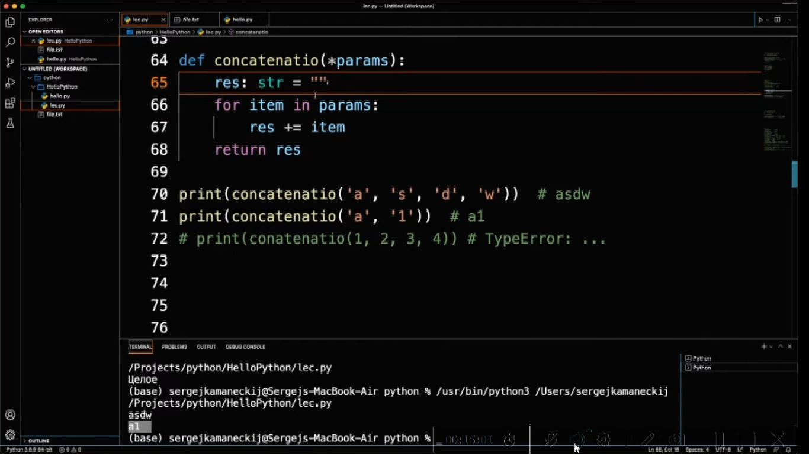

1 )  Первое, что необходимо, что бы использовать app Python для работы с текстовыми файлами.
<details>

<summary></summary>

```javascript

объявить (выделить) переменную, указать путь к файлу, указать в каком режиме с ним будем работать

``` 

</details>


2 )  Какие имеются основные режимы работы с текстовыми файлами
<details>

<summary></summary>

```javascript

a (что бы дописывать в файл)
r (позволяет читать данные)
w (позволяет создавать и записывать файлы замещая предыдущую информацию, если она была в файле)

микс вариант: w+, r+
``` 


</details>

. )  Что произойдет при инициализации дописывания не существующего файла ключом -a
<details>

<summary></summary>

```javascript

файл будет создан и в него начнется запись

``` 

</details>

. )  что произойдет при инициализации считывания не существующего файла (-r)
<details>

<summary></summary>

```javascript

произойдет ошибка

``` 

</details>

. )  Порядок работы с текстовым файлом
<details>

<summary></summary>


```javascript

а. Должен быть источник данных. (Например список стрк. 25)
б. Создается текстовая переменная. В округлых скобках первый элемент (перед запятой) указывается путь к файлу txt.  Второй элемент в округлых скобках указывается МОД (ключ) с которым будем работать (Прим. стрк. 26)
в. Функциональная строка (например стрк. 27 позволяет записать набор данных) в качестве аргумента в округлых скобках передает набор данных (в данном случае список - указанный в стрк. 25)
г. По окончанию работы текстовый файл должен быть закрыт, или должна быть разорвана связь (пример указан стрк. 28) что бы не возникала ошибка при обращении к файлу ("файл занят другим процессом")

``` 

</details>

. )  Пример записи в разные строки
<details>

<summary></summary>


* строки 28,29 (используются символы по окончании строк, \n) в результате при каждом использовании одних и тех же команд при запуске информация записываетсы уже ниже предыдущих строк но так же в две строки

```javascript

Таблица символов

``` 

</details>

. )  Пример конструкции строк записи позволяющих не вызывать код разрыва связи с файлом
<details>


<summary></summary>

```javascript

. . .

``` 

</details>

. )  Пример строки чтения с файла
<details>


<summary></summary>

```javascript

. . .

``` 

</details>

. )  Что необходимо сделать для использования числ из текстового файла.
<details>

<summary></summary>

```javascript

Перевести в числовой формат, т.к. вся информация в этих файлах хранится в текстовом виде

``` 

</details>

. )  Пример использования функции из соседнего файла
<details>

* при наличии файла например hello
c функцией с именем (индефикатором) f:

вызов работы функции происходит как указано:


<summary></summary>

```javascript

. . .

``` 

</details>

. )  Пример вызова функции из соседнего файла с использованием короткого псевдонима
<details>


<summary></summary>

```javascript

. . .

``` 

</details>

. )  Пример использования значения функции по умолчанию
<details>

Функция без использования значения по умолчанию


Функция с исполльзованием значения по умолчанию


<summary></summary>

```javascript

. . .

``` 

</details>

. )  Пример использования разных групп множественных аргументов функции
<details>



По умолчанию результаты и значения функции является текстовым

 Пример использования числовых значений:

 

<summary></summary>

```javascript

. . .

``` 

</details>

. )  Пример использования рекурсии
<details>


<summary></summary>

```javascript

. . .

``` 

</details>

. ) Что такое картеж
<details>

<summary></summary>


```javascript

. . .

``` 

</details>

. )  Пример картежей и вариантов обращения к нему
<details>

<summary></summary>


```javascript

Пример котежа из одного элемента:

``` 


</details>

. ) Возможно ли элементам картежа присваивать значения
<details>

<summary></summary>

```javascript

элементам картежа значения не присваиваются, и попытка присваивания вызовет ошибку, т.к. картеж является неизменяемым списком

``` 

</details>

. )  Пример создания списка, затем преобразование его в кортеж, затем распаковка с созданием на его основе независимых переменных

<details>

<summary></summary>


```javascript

. . .

``` 

</details>

. )  Что такое словари
<details>

<summary></summary>


```javascript

. . .

``` 

</details>


. )  Пример объявления пустого словаря и пример объявления словаря с парными элементами, вывести весь словать или вывести конкретное значение

<details>

<summary></summary>


```javascript

. . .

``` 

</details>

. ) Что применяется для переход на новую строку

<details>

<summary></summary>

```javascript

Бэкслэш: \

``` 

</details>

. )  Как вывести на экран все ключи

<details>

<summary></summary>

```javascript

Строки: 160, 161

``` 


</details>


. ) Что используется для описания с новой стороки

<details>

<summary></summary>

```javascript

Бэкслэш: \

``` 

</details>


. )  Как вывести на экран все значения

<details>

<summary></summary>


```javascript

. . .

``` 

</details>


. )  "Проийтись" по всем элементам

<details>

<summary></summary>


```javascript

. . .

``` 

</details>


. )  Получить только значения

<details>

<summary></summary>


```javascript

. . .

``` 

</details>


. )  Что произойдет при обращении к несуществующему ключу

<details>

<summary></summary>

```javascript

Произойдет ошибка

``` 

</details>


. )  Множество содержит

<details>

<summary></summary>


```javascript

Уникальные элементы

``` 

</details>


. )  Функционал множеств: 1) Как объявляется 2) какой тип данных
                          3) Как вывести элементы 4) как добавить элемент
4) удаление элемента 5) очистить множество
<details>

<summary></summary>


```javascript

1. объявляется множество строка 171
2. set()
3. вывести элементы строка 172
4. добавить элемент строка 175 (если добавить существующий элемент как указано в строке 173, ошибок не произойдет но список элементов останется прежним)
5. удаление элемента строка 177 или 180(не вызывает ошибки в случае если удаляемый элемент и так отсуствует)
6. полностью очистить множество строка 182

``` 


</details>

. ) Какие операции определены для множеств

<details>

<summary></summary>

```javascript

Пересечение, объединение, разность, симетрическая разность и т.д.

``` 

</details>

. ) Примеры операций с множествами

<details>

<summary></summary>

```javascript
- строки 191, 192 создание множества
- строка 193 пример создания множества на основе имеющегося множества
- строка 194 объединение множеств
- строка 195-197 примеры других операций множеств
а, так же обещали в исходниках приложенных к лекции которых по факту пока там нет

``` 


</details> 

)  Пример создания не изменяемого (замороженного) множества

<details>

<summary></summary>

```javascript

Строка 204

``` 


</details>

. )  Таблица символоволов

<details>

<summary></summary>

```javascript

Таблица символов

``` 

</details>

. )  Юникод

<details>

<summary></summary>

```javascript

Узнать код символа в питоне можно операцией ord, а узнать символ по коду можно операцией chr. Например:

ch = input()         # считали символ...
print(ord(ch))       # и вывели его код

i = ord('$')         # записали в i код доллара
print(i)

i = int(input())     # считали код
print(chr(i))       # и вывели соответствующий символ

ch = chr(ord('$') + 1)
print(ch)            # вывели символ, следующий за долларом

``` 

</details>. )  . . .

<details>

<summary></summary>

```javascript

. . .

``` 

</details>. )  . . .

<details>

<summary></summary>

```javascript

. . .

``` 

</details>. )  . . .

<details>

<summary></summary>

```javascript

. . .

``` 

</details>