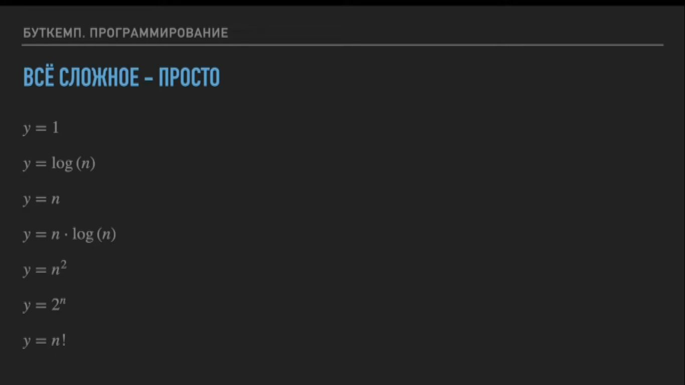
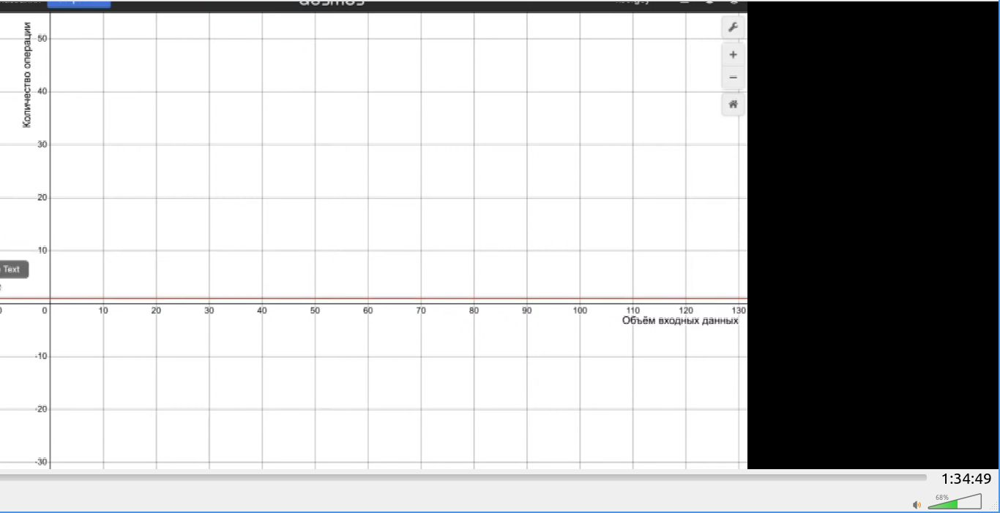
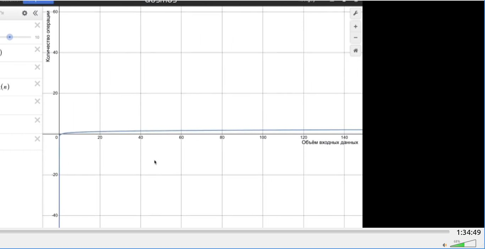
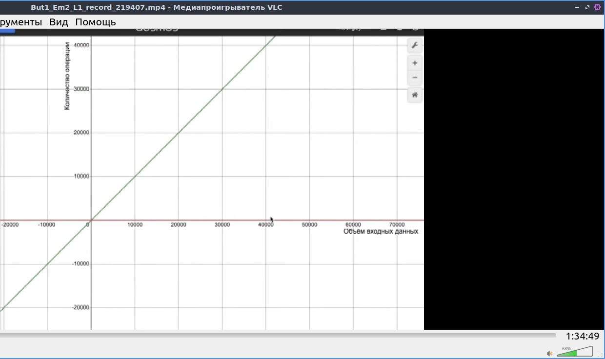
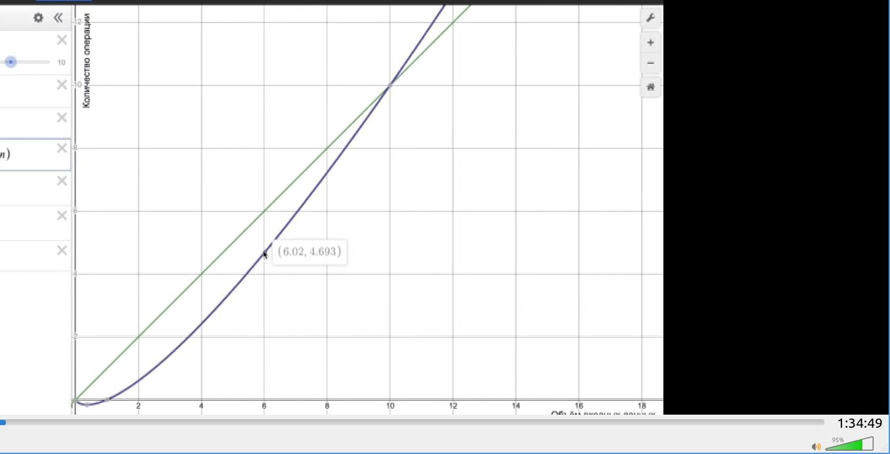

1) уровнения сложности

<details>
<summary></summary>




</details>

2) что такое константная сложность, (уравнение: у = 1)

<details>
<summary></summary>

```javascript

Означает, что независомо от количества поступивших данных операция будет выполнена одна.
Например операция присваивания. Или вызова массива и т.п.

```


</details>


3) что такое лагорифмическая зависимость, y = log(n)

<details>
<summary></summary>

```javascript
Количество операция находится в лагорифмической зависимости от объема данных. 

Например алгоритм бинарного (тихотомического) поиска 

```




</details>

4) что такое линейная сложность, y = n

<details>
<summary></summary>





```javascript

пример: линейной сложности поочередный перебор элементов для поиска нужного элемента в массиве 

```

</details>

5) Что такое и какие особенности линейно-логорифмической сложности, y = n * log(n)

<details>
<summary></summary>

```javascript

Линейно-логорифмическая сложность объединяет в себе методы этих функций. На малых значениях является более выгодной, т.е менее сложной относительно линейной функции, а на более высоких значениях наборот по сложности значительно ее превосходит.

```

</details>

..).......

<details>
<summary></summary>

```javascript
.....................

```

</details>

..).......

<details>
<summary></summary>

```javascript
.....................

```

</details>

..).......

<details>
<summary></summary>

```javascript
.....................

```

</details>

..).......

<details>
<summary></summary>

```javascript
.....................

```

</details>

..).......

<details>
<summary></summary>

```javascript
.....................

```

</details>

..).......

<details>
<summary></summary>

```javascript
.....................

```

</details>

..).......

<details>
<summary></summary>

```javascript
.....................

```

</details>

..).......

<details>
<summary></summary>

```javascript
.....................

```

</details>

..).......

<details>
<summary></summary>

```javascript
.....................

```

</details>