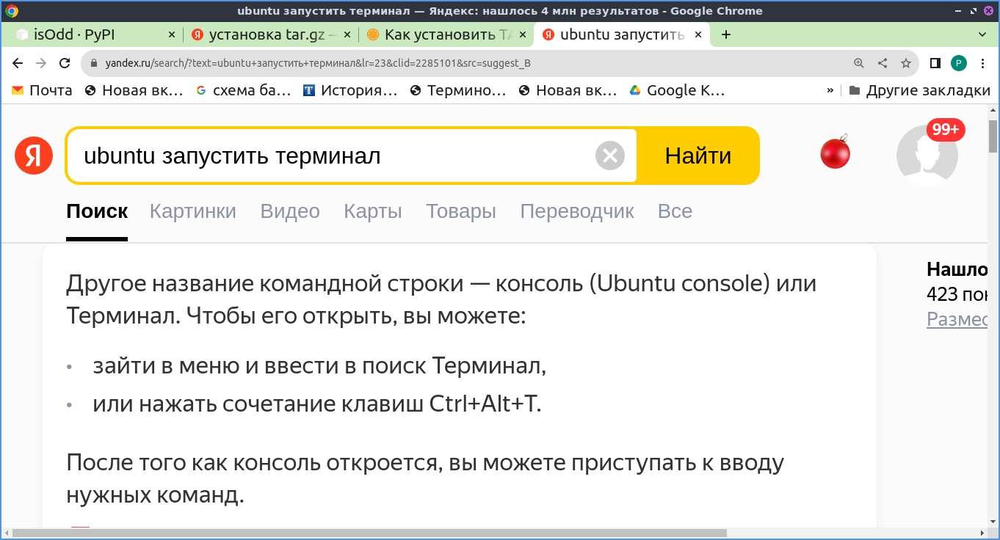

1)Обновить пакеты
<details>
<summary></summary>

```javascript

sudo apt update

sudo apt upgrade

sudo apt full-upgrade

```

</details>

..)Установить PyCharm

<details>
<summary></summary>

```javascript

Бесплатная версия (ограничение по базам данным и созданию сайтов):

sudo snap install pycharm-community --classic

Полная версия:

sudo snap install pycharm-professional --classic

```

</details>

..) Удаление Genymotion

<details>
<summary></summary>

```javascript

Из папки где было, (т.к. с помощью apt-get uninstall удаляется если только программа была установлена с помощью apt-get install)

./genymotion-3.1.2-linux_x64.bin --uninstall

```

</details>

..)Открыть редактор
<details>
<summary></summary>



```javascript


```

</details>

..)...
<details>
<summary></summary>

```javascript

.....

```

</details>

..)...
<details>
<summary></summary>

```javascript

.....

```

</details>

..)...
<details>
<summary></summary>

```javascript

.....

```

</details>

..)...
<details>
<summary></summary>

```javascript

.....

```

</details>

..)...
<details>
<summary></summary>

```javascript

.....

```

</details>

..)...
<details>
<summary></summary>

```javascript

.....

```

</details>

..)...
<details>
<summary></summary>

```javascript

.....

```

</details>

..)...
<details>
<summary></summary>

```javascript

.....

```

</details>

..)...
<details>
<summary></summary>

```javascript

.....

```

</details>

..)...
<details>
<summary></summary>

```javascript

.....

```

</details>

..)...
<details>
<summary></summary>

```javascript

.....

```

</details>

..)...
<details>
<summary></summary>

```javascript

.....

```

</details>

..)...
<details>
<summary></summary>

```javascript

.....

```

</details>

..)...
<details>
<summary></summary>

```javascript

.....

```

</details>